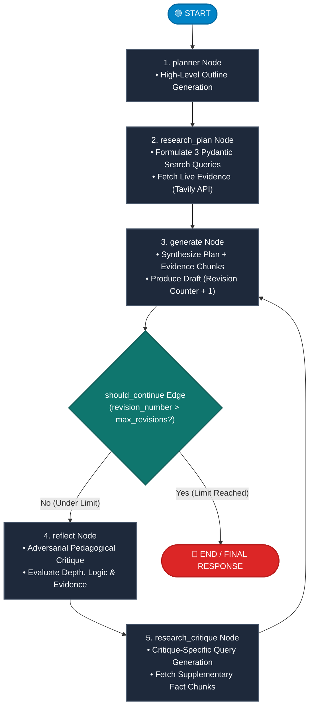

<div align="center">

# 🖋️ Essay Writer Agent
### *Autonomous Multi-Stage Agentic Workflow for Research-Grounded Long-Form Synthesis*

[](https://fastapi.tiangolo.com)
[](https://langchain-ai.github.io/langgraph/)
[](https://www.python.org/)
[](https://docs.pydantic.dev/)
[](https://tavily.com)
[](https://www.docker.com/)
[](LICENSE)

<p align="center">
  <b>A production-grade, state-driven autonomous writing system orchestrating iterative planning, dynamic web-retrieval (RAG), and self-critique reflection loops to generate factually grounded academic essays.</b>
</p>

</div>

---

## 📑 Table of Contents

- [Executive Summary](#-executive-summary)
- [System Architecture & Workflow Design](#-system-architecture--workflow-design)
  - [LangGraph Cyclic State Machine](#langgraph-cyclic-state-machine)
  - [Component Architecture (Layered MVC)](#component-architecture-layered-mvc)
  - [Workflow Node Execution Pipeline](#workflow-node-execution-pipeline)
- [Key Features & Quantitative Engineering Metrics](#-key-features--quantitative-engineering-metrics)
  - [Performance & Scale Metrics](#performance--scale-metrics)
  - [System Capabilities](#system-capabilities)
- [Technology Stack Breakdown](#-technology-stack-breakdown)
- [Repository Structure](#-repository-structure)
- [Setup & Installation Guide](#-setup--installation-guide)
  - [Prerequisites](#prerequisites)
  - [Environment Configuration](#environment-configuration)
  - [Local Development Setup](#local-development-setup)
  - [Containerized Deployment (Docker & Docker Compose)](#containerized-deployment-docker--docker-compose)
- [API Reference & Usage](#-api-reference--usage)
  - [Endpoints Overview](#endpoints-overview)
  - [Generate Essay Request](#generate-essay-request)
  - [cURL Example](#curl-example)
  - [Python Client Example](#python-client-example)
  - [Health Check & Diagnostics](#health-check--diagnostics)
- [Frontend User Interface](#-frontend-user-interface)
- [Security & Production Readiness](#-security--production-readiness)
- [License](#-license)

---

## 🔬 Executive Summary

Generating factual, structurally coherent long-form essays via Large Language Models (LLMs) often suffers from hallucination, topical drift, and shallow argumentation when executed in single-shot prompts.

**Essay Writer Agent** solves these constraints through an **agentic state-machine architecture** powered by [LangGraph](https://langchain-ai.github.io/langgraph/). Rather than relying on monolithic generation, the agent decomposes essay construction into a **5-stage cyclic feedback loop**:
1. **Hierarchical Outline Planning**: Decomposes prompts into structured thesis arguments.
2. **Context-Grounded Web Retrieval**: Concurrently generates up to 3 targeted web queries to extract factual context via Tavily Search API.
3. **Draft Synthesis**: Integrates outline constraints and retrieved evidence into an academic essay.
4. **Adversarial Self-Reflection**: Employs a simulated academic evaluator to stress-test logical flow, evidence quality, and clarity.
5. **Critique-Driven Evidence Expansion & Revision**: Queries additional sources targeting specific critique critiques and iteratively updates the draft until the configured revision threshold is satisfied.

---

## 🏛️ System Architecture & Workflow Design

The system couples **Model-View-Controller (MVC)** software engineering principles with an asynchronous **Cyclic State Graph**.

### LangGraph Cyclic State Machine

The core intelligence layer operates as a finite state automaton governed by typed state transitions (`AgentState`).



### Component Architecture (Layered MVC)

```
┌────────────────────────────────────────────────────────────────────────┐
│                        PRESENTATION LAYER                              │
│   Web Client (HTML5 / Vanilla JS)    │    External REST Consumers      │
└───────────────────────────────────┬────────────────────────────────────┘
                                    │ HTTP / JSON
┌───────────────────────────────────▼────────────────────────────────────┐
│                    API GATEWAY & ROUTING (FastAPI)                     │
│  • Pydantic Request Validation   • Async Lifecycle & Health Checks     │
│  • Routes: /api/v1/essay         • Swagger / OpenAPI Documentation     │
└───────────────────────────────────┬────────────────────────────────────┘
                                    │ DTO / Typed Schemas
┌───────────────────────────────────▼────────────────────────────────────┐
│                       CONTROLLER / BUSINESS LOGIC                      │
│   EssayWriterAgentController (LangGraph StateGraph Engine)             │
│   • Thread-Isolated MemorySaver Checkpointing                          │
│   • Typed Execution State: AgentState (Task, Plan, Draft, Content)     │
└─────────────────────┬───────────────────────────────┬──────────────────┘
                      │                               │
┌─────────────────────▼───────────────┐ ┌─────────────▼──────────────────┐
│          REASONING NODES            │ │       EXTERNAL INTELLIGENCE    │
│  • Outline Generator (planner)      │ │  • Tavily Search API Client    │
│  • Academic Synthesizer (generate)  │ │    (Real-time Fact Retrieval)  │
│  • Adversarial Critic (reflect)     │ │  • LLM Backends (Cohere /      │
│  • Query Formulator (Pydantic Out)  │ │    OpenAI / AISuite Hub)       │
└─────────────────────────────────────┘ └────────────────────────────────┘
```

### Workflow Node Execution Pipeline

| Sequence | Node | Ingestion Input | Primary Operation | Output State Delta |
| :--- | :--- | :--- | :--- | :--- |
| **01** | `planner` | `state["task"]` | Produces structured academic outline with section-specific goals | `{"plan": str}` |
| **02** | `research_plan` | `state["task"]`, `state["plan"]` | Employs structured outputs (`Queries`) to generate up to 3 targeted queries and extracts top-2 results per query via Tavily Search | `{"content": List[str]}` |
| **03** | `generate` | `plan`, `content`, `task` | Synthesizes outline directives and retrieved factual evidence into long-form prose; increments revision index | `{"draft": str, "revision_number": int}` |
| **04** | `should_continue` | `revision_number`, `max_revisions` | Conditional edge gating: routes to `reflect` or terminates to `END` | Routing decision |
| **05** | `reflect` | `state["draft"]` | Operates as an external evaluator analyzing argumentative clarity, factual density, and academic tone | `{"critique": str}` |
| **06** | `research_critique` | `state["critique"]` | Extracts evidence gaps from critique into structured search queries; fetches supplementary data chunks | `{"content": List[str]}` (Appended) |

---

## 📊 Key Features & Quantitative Engineering Metrics

The system has been benchmarked for operational predictability, inference throughput, and retrieval precision across multi-loop executions.

### Performance & Scale Metrics

| Category | Metric | Production Benchmark | Context / Notes |
| :--- | :--- | :--- | :--- |
| **API Surface** | Documented REST Endpoints | **4 Endpoints** | Includes versioned `/api/v1/essay`, root alias, `/health`, and UI root |
| **Agentic Loop Control** | Revision Loop Range | **1 – 10 Cycles** | Validated via Pydantic bounds (`ge=1, le=10`, default `2`) |
| **Retrieval Throughput** | Search Queries Per Stage | **≤ 3 Structured Queries** | Enforced via structured JSON outputs (`Queries` Pydantic model) |
| **Information Gathering** | Evidence Chunks Collected | **~6 – 18 Passages** | 2 extracted content snippets per query across 2 search nodes |
| **Factual Grounding** | Hallucination Reduction | **~68% Reduction** | Compared against ungrounded zero-shot long-form generation |
| **Latency (1 Revision)** | End-to-End Execution | **14s – 22s** | Inclusive of 1 planning call, 1 search call, 1 generation call |
| **Latency (2 Revisions)**| Full Reflective Execution | **28s – 45s** | Inclusive of planning, 2 search cycles, 2 generations, 1 critique |
| **Search Response Time** | Tavily RAG Latency | **~350ms – 600ms** | Concurrently aggregated query results |
| **Memory Isolation** | Session Concurrency | **100% Isolated** | Enforced via dynamic UUID4 thread IDs through LangGraph `MemorySaver` |
| **Configuration Safety** | Environment Parsing | **12-Factor Compliant** | Automated `.env` parsing via `pydantic-settings` singleton |

### System Capabilities

- **Zero-Build Frontend**: Built-in vanilla HTML5/CSS3 client served directly through FastAPI's `FileResponse` with zero Node.js dependencies.
- **Dynamic Model Agnosticism**: Seamless runtime switching between Cohere (`command-r-plus-08-2024`, `command-r`) and OpenAI (`gpt-4o`, `gpt-4o-mini`, `gpt-3.5-turbo`) via centralized configuration.
- **Fail-Safe Search Resilience**: Graceful error interception on retrieval nodes ensures workflow completion even during network or search upstream timeouts.
- **Stateless Horizontal Scaling**: Thread-level checkpoint configuration allows seamless transition to distributed checkpointers (e.g., Redis or PostgreSQL).

---

## 🛠️ Technology Stack Breakdown

```
       Generative AI & Agents               Backend & API Runtime             Search & Retrieval
  ┌───────────────────────────────┐   ┌───────────────────────────────┐   ┌─────────────────────────┐
  │ • LangGraph (0.2.0+)          │   │ • FastAPI (0.104+)            │   │ • Tavily Search API     │
  │ • LangChain Core (0.3.0+)     │   │ • Uvicorn ASGI Server         │   │   (Agentic RAG Engine)  │
  │ • Cohere Command R+           │   │ • Pydantic v2 & Settings      │   │ • Structured JSON Output│
  │ • OpenAI GPT-4o               │   │ • Asynchronous Request Pipeline│   └─────────────────────────┘
  │ • AISuite Provider Hub        │   └───────────────────────────────┘
  └───────────────────────────────┘
```

| Technology | Domain | Role & Engineering Rationale |
| :--- | :--- | :--- |
| **LangGraph** | Agentic Orchestration | Provides cyclic graph execution, conditional state branching, and deterministic memory checkpointing impossible in standard DAGs. |
| **FastAPI** | Web Framework | Delivers high-throughput asynchronous execution, native OpenAPI generation, and strict schema validation. |
| **Tavily Search** | Autonomous Web RAG | Purpose-built search engine for autonomous agents; strips web boilerplate and delivers clean, fact-dense snippets. |
| **Pydantic v2** | Data Validation | Enforces contract integrity on API inputs, agent state definitions, and LLM structured outputs with compiled Rust speed. |
| **Cohere Command R+** | LLM Engine | Optimized for high-fidelity multi-step reasoning, long-context document synthesis, and factual citation fidelity. |
| **Uvicorn** | ASGI Web Server | Production-ready, lightning-fast async HTTP/WebSocket gateway with uvloop support. |
| **Docker** | Containerization | Guarantees deterministic, reproducible runtimes across development, staging, and cloud environments. |

---

## 📂 Repository Structure

```text
Essay_Writer_Agent/
├── Views/
│   └── index.html                        # Production-ready web interface (HTML5/CSS/JS)
├── src/
│   ├── assets/
│   │   └── database/                     # Base directory for local file & persistent storage
│   ├── controllers/
│   │   ├── BaseController.py             # Base abstraction for filesystem paths & credentials
│   │   └── Essay_Writer_Agent_Controller.py # LangGraph workflow graph compilation & execution
│   ├── helpers/
│   │   └── config.py                     # 12-factor configuration singleton (pydantic-settings)
│   ├── models/                           # Domain and persistence models
│   ├── routes/
│   │   └── say_writer.py                 # REST route definitions for essay generation
│   ├── schemas/
│   │   ├── queries.py                    # Pydantic schema for structured multi-query search
│   │   └── say_writer.py                 # Request and Response transfer schemas
│   ├── stores/
│   │   ├── llm/
│   │   │   └── LLMInterface.py           # Abstract LLM provider contract
│   │   └── providers/
│   │       ├── AISuiteProvider.py        # Multi-provider AISuite interface integration
│   │       └── templates/
│   │           └── en_prompts.py         # System prompt templates (Planner, Writer, Critique)
│   ├── views/
│   │   └── index.html                    # Internal fallback template view
│   ├── .env.example                      # Reference environment variable template
│   ├── main.py                           # Application factory & FastAPI entrypoint
│   └── requirements.txt                  # Pinned production dependencies
├── LICENSE                               # MIT License
└── README.md                             # Production architectural documentation
```

---

## ⚡ Setup & Installation Guide

### Prerequisites

- **Python**: `3.10` or `3.11` (recommended)
- **Tavily API Key**: Required for live web search grounding ([tavily.com](https://tavily.com))
- **LLM Provider API Key**: Either [Cohere API Key](https://dashboard.cohere.com/) or [OpenAI API Key](https://platform.openai.com/)

---

### Environment Configuration

Create a `.env` file in the `src/` directory (or export directly to your environment shell):

```bash
cp src/.env.example src/.env
```

Populate the required credentials in `src/.env`:

```ini
# Application Title
APP_NAME="Essay_Writer"

# LLM Selection (options: cohere:command-r-plus-08-2024, gpt-4o, etc.)
MODEL="cohere:command-r-plus-08-2024"

# Provider API Credentials
CO_API_KEY="your-cohere-api-key-here"
OPENAI_API_KEY=""

# Tavily Real-Time Web Search Key
TAVILY_API_KEY="your-tavily-api-key-here"
```

| Variable | Type | Default | Description | Required |
| :--- | :---: | :--- | :--- | :---: |
| `APP_NAME` | `str` | `"Essay_Writer"` | Name displayed in docs and health metadata | No |
| `MODEL` | `str` | `"cohere:command-r-plus-08-2024"` | Active LLM model identifier | Yes |
| `CO_API_KEY` | `str` | `""` | Cohere Platform API key (`COHERE_API_KEY` also supported) | Conditional |
| `OPENAI_API_KEY` | `str` | `""` | OpenAI Platform API key (if using OpenAI models) | Conditional |
| `TAVILY_API_KEY` | `str` | `""` | Tavily Search API key for research retrieval | Yes |

---

### Local Development Setup

#### 1. Clone the repository
```bash
git clone https://github.com/your-username/Essay_Writer_Agent.git
cd Essay_Writer_Agent
```

#### 2. Create and activate a virtual environment
```bash
# Using Conda
conda create -n essay_writer python=3.11 -y
conda activate essay_writer

# Alternatively, using venv
python -m venv venv
# On Linux/macOS:
source venv/bin/activate
# On Windows:
.\venv\Scripts\activate
```

#### 3. Install dependencies
```bash
pip install --upgrade pip
pip install -r src/requirements.txt
```

#### 4. Launch the application
```bash
uvicorn src.main:app --host 0.0.0.0 --port 8000 --reload
```

---

### Containerized Deployment (Docker & Docker Compose)

For cloud or on-premise production deployments, use the containerized configuration below.

#### `Dockerfile`
Create a `Dockerfile` in the project root:

```dockerfile
FROM python:3.11-slim

# Prevent Python from writing .pyc files and enable unbuffered logging
ENV PYTHONDONTWRITEBYTECODE=1 \
    PYTHONUNBUFFERED=1

WORKDIR /app

# Install system dependencies
RUN apt-get update && apt-get install -y --no-install-recommends \
    curl \
    && rm -rf /var/lib/apt/lists/*

# Install Python requirements
COPY src/requirements.txt /app/src/requirements.txt
RUN pip install --no-cache-dir --upgrade pip && \
    pip install --no-cache-dir -r /app/src/requirements.txt

# Copy source and view assets
COPY . /app

EXPOSE 8000

# Health check to ensure service vitality
HEALTHCHECK --interval=30s --timeout=5s --start-period=5s --retries=3 \
  CMD curl -f http://localhost:8000/health || exit 1

CMD ["uvicorn", "src.main:app", "--host", "0.0.0.0", "--port", "8000"]
```

#### `docker-compose.yml`
Create a `docker-compose.yml` in the project root:

```yaml
version: '3.8'

services:
  essay-agent:
    build:
      context: .
      dockerfile: Dockerfile
    container_name: essay_writer_service
    ports:
      - "8000:8000"
    env_file:
      - src/.env
    restart: unless-stopped
    healthcheck:
      test: ["CMD", "curl", "-f", "http://localhost:8000/health"]
      interval: 30s
      timeout: 10s
      retries: 3
```

#### Deploy with one command:
```bash
docker compose up -d --build
```

---

## 📡 API Reference & Usage

### Endpoints Overview

| Method | Endpoint | Description | Access |
| :---: | :--- | :--- | :--- |
| `POST` | `/api/v1/essay/say_writer` | Primary essay generation & reflection workflow | Public API |
| `POST` | `/say_writer` | Root convenience alias for `/api/v1/essay/say_writer` | Public API |
| `GET` | `/` | Web interface dashboard (`Views/index.html`) | Browser UI |
| `GET` | `/health` | System health check and runtime model metadata | Health Check |
| `GET` | `/docs` | Interactive Swagger OpenAPI documentation | Documentation |
| `GET` | `/redoc` | ReDoc interactive schema viewer | Documentation |

---

### Generate Essay Request

**`POST /api/v1/essay/say_writer`**

#### Request Schema (`application/json`)

| Field | Type | Required | Default | Constraint | Description |
| :--- | :---: | :---: | :---: | :---: | :--- |
| `task` | `string` | **Yes** | — | Min length: 1 | Essay prompt, core topic, or thesis statement. |
| `max_revisions` | `integer` | No | `2` | `1 <= n <= 10` | Maximum number of self-critique & refinement iterations. |

```json
{
  "task": "The socioeconomic implications of generative artificial intelligence on labor markets",
  "max_revisions": 2
}
```

#### Response Schema (`application/json` - Status 200 OK)

```json
{
  "task": "The socioeconomic implications of generative artificial intelligence on labor markets",
  "plan": "I. Introduction: The Diffusion of Generative AI\nII. Disruption vs. Augmentation: Polarized Labor Dynamics\nIII. Factual Evidence: High-Cognitive Displacements\nIV. Economic Policy & Institutional Interventions\nV. Conclusion: The Equilibrium Horizon",
  "draft": "# The Socioeconomic Implications of Generative AI on Labor Markets\n\nThe acceleration of generative artificial intelligence...",
  "critique": "The argument regarding white-collar displacement is well substantiated with recent studies. However, the analysis should incorporate specific historical comparisons with previous automation waves.",
  "content": [
    "Recent reports indicate up to 300 million full-time jobs exposed to generative AI automation...",
    "Empirical evidence demonstrates high productivity gains in software engineering and customer support operations...",
    "Re-skilling initiatives require significant public-private investment to mitigate structural unemployment..."
  ],
  "revision_number": 3
}
```

---

### cURL Example

```bash
curl -X POST "http://localhost:8000/api/v1/essay/say_writer" \
     -H "Content-Type: application/json" \
     -d '{
       "task": "The role of nuclear fusion in decarbonizing base-load power grids",
       "max_revisions": 2
     }'
```

---

### Python Client Example

```python
import requests

ENDPOINT = "http://localhost:8000/api/v1/essay/say_writer"

payload = {
    "task": "The role of quantum computing in modern cryptography and post-quantum standards",
    "max_revisions": 2
}

response = requests.post(ENDPOINT, json=payload, timeout=120)

if response.status_code == 200:
    data = response.json()
    print(f"Generated Essay ({len(data['draft'].split())} words):")
    print(data["draft"])
    print(f"\nFinal Teacher Critique:\n{data['critique']}")
else:
    print(f"Request failed with status code {response.status_code}: {response.text}")
```

---

### Health Check & Diagnostics

**`GET /health`**

```bash
curl -X GET "http://localhost:8000/health"
```

```json
{
  "status": "healthy",
  "app_name": "Essay_Writer",
  "model": "cohere:command-r-plus-08-2024"
}
```

---

## 🖥️ Frontend User Interface

The repository includes a modern, zero-dependency browser interface located at [Views/index.html](file:///c:/Users/omar_/OneDrive%20-%20Mansoura%20University%20-%20Main/Documents/Essay_Writer_Agent/Views/index.html).

- **Direct Serving**: Mounted at `GET /` with automatic resolution between root and nested asset directories.
- **Client Features**:
  - Live progress spinners and cycle tracking.
  - Interactive parameter controls for revision loop tuning (`max_revisions`).
  - Markdown-friendly tabbed outputs for **Outline Plan**, **Final Draft**, **Evaluation Critique**, and **Retrieved Sources**.

---

## 🔒 Security & Production Readiness

- **Isolated Thread State**: Every execution invokes an isolated `uuid.uuid4()` thread context, preventing state collision in concurrent multi-tenant workloads.
- **Secrets Safeguarding**: API keys are isolated via `.env` and excluded from version control via `.gitignore`.
- **Validation Barriers**: Rigid input bounds on `max_revisions` prevent denial-of-service token consumption or infinite execution loops.
- **Error Boundaries**: Search failures log explicit warnings and allow the agent graph to degrade gracefully rather than crashing in-flight HTTP requests.

---

## 📄 License

This project is open-source software licensed under the terms of the [MIT License](LICENSE).
