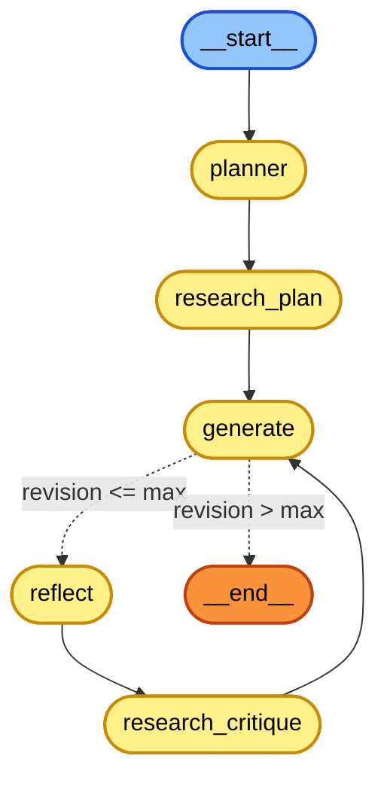

# 📝 Essay Writer Agent

An autonomous agentic system built with **LangGraph**, **FastAPI**, and **Tavily Search** that crafts high-quality essays through an iterative cycle of planning, web research, drafting, self-critique, and revisions.

The project follows an **MVC (Model-View-Controller)** architecture and includes both a REST API and a built-in minimalist web interface.

---

## 🔄 Agent Workflow Graph

The essay generation process is modeled as a state machine using LangGraph:



### Workflow Nodes

1. **`planner`**: Analyzes the essay topic and produces a structured, high-level outline.
2. **`research_plan`**: Formulates targeted web search queries based on the outline and fetches relevant information using Tavily Search.
3. **`generate`**: Synthesizes the outline and research findings into a cohesive essay draft.
4. **`reflect`**: Critiques the draft from a teacher/grader perspective, highlighting areas for improvement (depth, structure, clarity).
5. **`research_critique`**: Formulates follow-up search queries addressing the critique points.
6. **`should_continue`** *(conditional edge)*: Determines whether to loop back to `generate` for another revision or terminate at `__end__` once `max_revisions` is reached.

---

## 🚀 Key Features

* **Iterative Reflection**: Self-improving draft cycle with automated critiques and revisions.
* **Live Web Research**: Integration with Tavily Search API for up-to-date factual backing.
* **Centralized Configuration**: Environment settings managed via `pydantic-settings`.
* **FastAPI Backend**: Asynchronous REST endpoints with Pydantic request/response validation.
* **Built-in Frontend View**: Clean vanilla HTML/CSS/JS frontend served directly by FastAPI without requiring node.js or build steps.
* **MVC Structure**: Clean separation of schemas (Models), workflows (Controllers), and UI (Views).

---

## 📁 Project Structure

```text
Essay_Writer_Agent/
├── Views/
│   └── index.html               # Frontend UI view (plain HTML/CSS/JS)
├── src/
│   ├── assets/                  # Static assets and database storage
│   ├── controllers/
│   │   ├── BaseController.py    # Common controller utilities & paths
│   │   └── Essay_Writer_Agent_Controller.py  # LangGraph workflow orchestration
│   ├── helpers/
│   │   └── config.py            # Centralized settings & environment loader
│   ├── models/                  # Database models
│   ├── routes/
│   │   └── say_writer.py        # FastAPI router for essay generation
│   ├── schemas/
│   │   ├── queries.py           # Pydantic schema for structured search queries
│   │   └── say_writer.py        # Request and Response schemas
│   ├── stores/
│   │   ├── llm/
│   │   │   └── LLMInterface.py  # Abstract LLM provider interface
│   │   └── providers/
│   │       ├── AISuiteProvider.py
│   │       └── templates/
│   │           └── en_prompts.py # Prompts for planning, writing, & critique
│   ├── views/
│   │   └── index.html           # Internal view template
│   ├── .env                     # Local environment variables (API keys)
│   ├── .env.example             # Example environment file template
│   ├── main.py                  # FastAPI application entry point
│   └── requirements.txt         # Project dependencies
├── LICENSE
└── README.md
```

---

## 🛠️ Getting Started

### 1. Prerequisites

* **Python 3.10+** (Python 3.11 recommended)
* A [Cohere API Key](https://dashboard.cohere.com/) or [OpenAI API Key](https://platform.openai.com/)
* A [Tavily API Key](https://tavily.com/) for web search

### 2. Environment Setup

Clone the repository and set up a virtual or conda environment:

```bash
# Using Conda
conda create -n essay_writer python=3.11 -y
conda activate essay_writer

# Install dependencies
pip install -r src/requirements.txt
```

### 3. Configure API Keys

Create a `.env` file inside the `src/` directory (or edit `src/.env`):

```env
MODEL="cohere:command-r-plus-08-2024"
OPENAI_API_KEY=""
APP_NAME="Essay_Writer"
CO_API_KEY="your-cohere-api-key"
TAVILY_API_KEY="your-tavily-api-key"
```

---

## 🖥️ Running the Application

Start the application with Uvicorn from the project root:

```bash
uvicorn src.main:app --reload
```

The application will be available at:

* **Web Interface (Frontend)**: [http://127.0.0.1:8000/](http://127.0.0.1:8000/)
* **Interactive API Docs (Swagger)**: [http://127.0.0.1:8000/docs](http://127.0.0.1:8000/docs)
* **Alternative API Docs (ReDoc)**: [http://127.0.0.1:8000/redoc](http://127.0.0.1:8000/redoc)
* **Health Check**: [http://127.0.0.1:8000/health](http://127.0.0.1:8000/health)

---

## 📡 API Reference

### Generate Essay (`say_writer`)

**Endpoint**: `POST /api/v1/essay/say_writer` *(or root alias `POST /say_writer`)*

#### Request Body (`application/json`):

```json
{
  "task": "The impact of artificial intelligence on modern healthcare systems",
  "max_revisions": 2
}
```

#### Response Body (`application/json`):

```json
{
  "task": "The impact of artificial intelligence on modern healthcare systems",
  "plan": "I. Introduction\nII. Diagnostic Accuracy\nIII. Treatment Personalization\nIV. Ethical Challenges\nV. Conclusion",
  "draft": "Artificial intelligence (AI) is transforming healthcare by enhancing diagnostic precision...",
  "critique": "The essay provides strong arguments regarding diagnostics. Consider expanding upon data privacy concerns.",
  "content": [
    "AI diagnostics have shown high accuracy in radiology and pathology detection...",
    "Implementing machine learning models raises regulatory and privacy compliance needs..."
  ],
  "revision_number": 2
}
```

---

## 📄 License

This project is licensed under the [MIT License](LICENSE).
